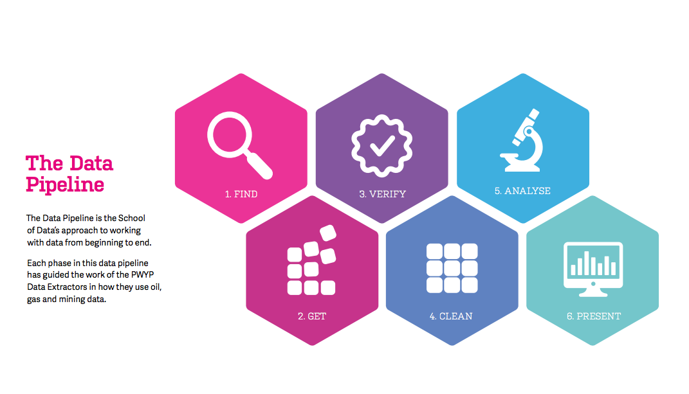
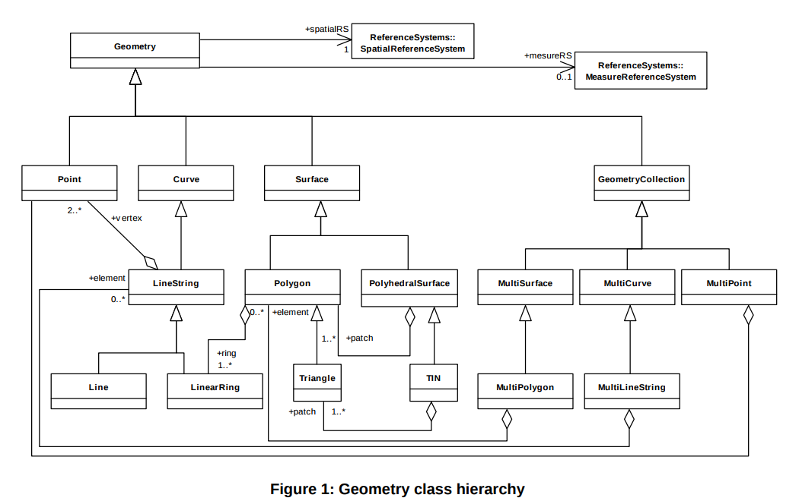
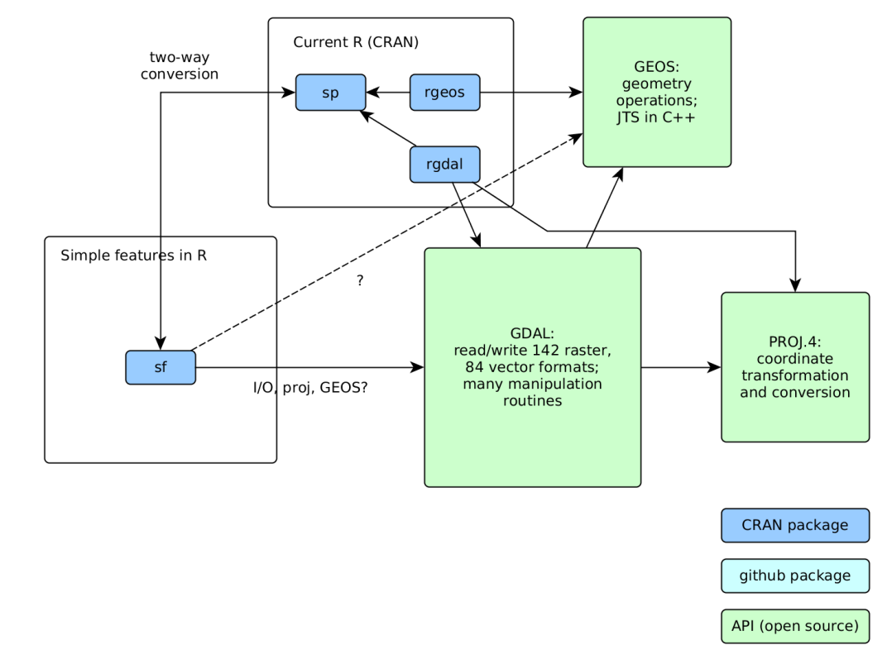

```{r setup, include=FALSE}
options(htmltools.dir.version = FALSE)
knitr::opts_chunk$set(cache = TRUE)
```

class: center, middle, title
background-image: url(./img/FraMauroDetailedMap.jpg)
background-size: cover
background-position: 50% 50%

# Les essentiels de la data science
## R : le couteau suisse des données

</BR>
</BR>
</BR>

###  Joël Gombin, avec Endi Pons


.right[.footnote[<a href='https://commons.wikimedia.org/wiki/File:FraMauroDetailedMap.jpg'>source</a>]]


---
class: center, middle

Retrouvez les matériaux sur https://github.com/datactivist/AUAT

Ces slides en ligne : http://datactivi.st/AUAT

Pad collaboratif : https://frama.link/AUAT

---
class: center, middle


---
class: inverse, center, middle

## Faisons connaissance

https://frama.link/formationR

???
Recueillir les réponses, générer le dashboard et montrer et expliquer le code

---
class: inverse, center, middle
## Un exemple de workflow
### (OSM, PostGis, R, Leaflet)

test_osm.R

???

Montrer quelques capacités spatiales/GIS de R en quelques lignes

---
class: inverse, center, middle
## Un exemple de workflow
### (OSM, BAN, leaflet, tmap, modélisation)

https://joelgombin.github.io/makingof


---
## Vos habitudes de travail

- postgis ?
- QGIS ?
- R ?
- OSM ?
- ...

---
## Vos données

Essayez d'amener des données sur lesquelles vous souhaitez travailler


---
## Les objectifs (jour 1)

- Comprendre les possibilités offertes par R
- Comprendre le pipeline de données
- Savoir importer des données dans R
- Comprendre la notion de tidy data
- Savoir transformer ses données en tidy 
- (si on a le temps) introduction à sf

---
## Le data pipeline 

```{r, echo = FALSE, out.width='90%', fig.align='center'}
knitr::include_graphics("./img/data-science.png")
```

???

Présenter les étapes du data pipeline
Divers outils, workflows fragmentés
Variante de ce pipeline : celui de School of Data

---
## Le data pipeline 

```{r, echo = FALSE, out.width='90%', fig.align='center'}

```

---
## One tool to rule them all

- R a comme avantage d'être un langage de programmation (= potentiel illimité) pensé exprès pour la manipulation des données (= usabilité, flexibilité)

- au fil du temps, devenu un "general purpose tool"

- permet d'interfacer de nombreux outils plus spécialisés

- une communauté très dynamique (free software)

- une syntaxe de plus en plus facile

- des progrès vers [des bouts de GUI](https://rstudio.github.io/rstudioaddins/)

---
## Se faire aider

* Des livres : 
  + [R for Data Science](http://r4ds.had.co.nz) de G. Grolemund et H. Wickham 
  + [Applied Spatial Data Analysis with R](http://gis.humboldt.edu/OLM/r/Spatial%20Analysis%20With%20R.pdf) de Bivand et al.
  + [An Introduction to R for Spatial Analysis and Mapping](https://www.amazon.com/Introduction-Spatial-Analysis-Mapping/dp/1446272958) de Brundson et Cumber
  + [R et espace](https://framabook.org/r-et-espace/), du groupe ElementR

* blogs : 
  + https://www.r-bloggers.com 
  + https://quanti.hypotheses.org/
  + https://politbistro.hypotheses.org
  + https://neocarto.hypotheses.org/
  + http://rgeomatic.hypotheses.org/
  + http://elementr.hypotheses.org/

---
## Se faire aider


* des listes de diffusion thématiques (ex : [la liste quanti](mailto:quanti@groupes.renater.fr), semin-r@mnhn.fr, r-soc@groupes.renater.fr), des forums (http://forums.cirad.fr/logiciel-R/)

* un site de Q/R communautaires : http://stackoverflow.com/questions/tagged/r

* twitter avec le hashtag [#Rstats](https://twitter.com/search?q=%23rstats)

* les [meetup R](https://www.meetup.com/fr-FR/rparis/)
   
* les [cheatsheets de Rstudio](https://www.rstudio.com/resources/cheatsheets/) 

---
## Prise en main de Rstudio

- raccourci pour exécuter une ligne de code : ctrl + entrée, pomme + entrée pour Mac

---
## Scripts, litterate programming, reproducible research

- toujours travailler dans le cadre d'un "projet"

- ne jamais travailler dans la console

- écrire des scripts

- mieux : mêler texte et code au moyen de [fichiers Rmd](http://rmarkdown.rstudio.com/)

- versionage (git)

- notebook

- commentez ! (avec le #)

```{r}
# ceci est un commentaire
```


---
## Installation du tidyverse

* Le `tidyverse` (ou hadleyverse) opérationnalise le workflow. Suite de packages pensés pour fonctionner ensemble

* La "glue" de ce package : le "pipe" `%>%` (Ctrl/Cmd + shift + M)

* Pour installer le tidyverse, entrez dans la console : `install.packages("tidyverse")` (ou via Rstudio)

* `library(tidyverse)` => charge le package

---
class: inverse, center, middle

# Importer des données

---
## En GUI ou en CLI

- bouton "Import dataset"

- en CLI : package `readr` pour le CSV, `haven` pour SPSS / SAS / Stata, `readxl` pour le XLS(X), `rio` pour (presque) tout le reste

*Et vous, quel(s) format(s) de données utilisez-vous habituellement ?*

---
## Importez votre premier jeu de données !

- chargement de package : `library(readr)` (ou `library(tidyverse)`)

- Attention à l'assignation : 

  `monjeudedonnees <- read_csv("monfichier.csv")` 

- Importons un jeu de données électoral : les résultats par commune du premier tour de l'élection présidentielle. Source : https://github.com/datactivist/presidentielle2017 (préparées avec https://github.com/joelgombin/LireMinInterieur)

---
## Importez votre premier jeu de données !

```{r }
suppressPackageStartupMessages(library(tidyverse))
pres2017T1_communes <- read_csv("./data/Presidentielle_2017_Resultats_Communes_T1_clean.csv")

```

## Importez votre premier jeu de données !

Si besoin, ajuster l'import au moyen des arguments `col_types`, `locale` ou encore `na`

```{r}
pres2017T1_communes <- read_csv("./data/Presidentielle_2017_Resultats_Communes_T1_clean.csv",
                       na = "",
                       col_types = cols(
  .default = col_double(),
  CodeInsee = col_character(),
  CodeDepartement = col_character(),
  Département = col_character(),
  Commune = col_character(),
  Inscrits = col_integer(),
  Abstentions = col_integer(),
  Votants = col_integer(),
  Blancs = col_integer(),
  Nuls = col_integer(),
  Exprimés = col_integer(),
  `LE PEN` = col_integer(),
  MÉLENCHON = col_integer(),
  MACRON = col_integer(),
  FILLON = col_integer(),
  LASSALLE = col_integer(),
  `DUPONT-AIGNAN` = col_integer(),
  HAMON = col_integer(),
  ASSELINEAU = col_integer(),
  POUTOU = col_integer(),
  ARTHAUD = col_integer(),
  CHEMINADE = col_integer()
  )
)
```

???

Expliquer les types de variable

---
## La notion de fonction

```{r}
sum(1, 2, 3)

a <- sum(1, 2, 3)

a
```


---
class: inverse, center, middle
# Le tidyverse 

---
## La notion de tidy data

> “Happy families are all alike; every unhappy family is unhappy in its own way.” – Tolstoï

> “Tidy datasets are all alike, but every messy dataset is messy in its own way.” – Hadley Wickham

- À chaque variable sa propre colonne

- À chaque observation sa propre ligne

- À chaque valeur sa propre cellule

---
## La notion de tidy data

```{r, echo = FALSE, out.width='90%', fig.align='center'}
knitr::include_graphics("./img/tidy-1.png")
``` 

---
## La notion de tidy data

- À chaque observation sa propre ligne

- À chaque variable sa colonne

- À chaque valeur sa propre cellule > 1 jeu de données par table, dite “tibble”

---
## Un exemple de untidy data

https://www.data.gouv.fr/fr/datasets/election-presidentielle-des-23-avril-et-7-mai-2017-resultats-definitifs-du-1er-tour-par-communes/

---
## Préparer des tidy data

- `dplyr` et `tidyr`

- le pipe : `%>%` (Ctrl/Cmd + shift + M)

- les verbes : 
  + `filter` (et `slice`)
  + `arrange`
  + `select` (et `rename`)
  + `distinct`
  + `mutate` 
  + `group_by` 
  + `summarise`
  + `sample_n` / `sample_frac`

- `stringr` peut utilement accompagner (manipulation de chaînes de caractères)


---
## Pivoter

`gather` et `spread`

```{r, echo = FALSE, out.width='90%', fig.align='center'}
knitr::include_graphics("http://r4ds.had.co.nz/images/tidy-9.png")
```

---
## Pivoter

```{r}

pres2017T1_communes_long <- pres2017T1_communes %>% 
  select(- contains("_ins")) %>%
  select(- contains("_exp")) %>%   
  gather(candidat, voix, `LE PEN`:CHEMINADE)

pres2017T1_communes_long
```

---
## Modifier

```{r}
pres2017T1_communes_long <- pres2017T1_communes_long %>% 
  mutate(ins = voix / Inscrits * 100) %>% 
  mutate(exp = voix / Exprimés * 100) %>%
  print
```

---
## Pivoter

```{r}
pres2017T1_communes_long %>% 
  gather(metrique, valeur, voix:exp) %>% 
  glimpse
```

---
## Pivoter

```{r}
pres2017T1_communes_long %>% 
  gather(metrique, valeur, voix:exp) %>% 
  unite(variable, candidat, metrique, sep = "_") %>% 
  glimpse
```

---
## Pivoter

```{r}
pres2017T1_communes_long %>% 
  gather(metrique, valeur, voix:exp) %>% 
  unite(variable, candidat, metrique, sep = "_") %>% 
  spread(variable, valeur) %>% 
  glimpse
```

---

class: inverse, center, middle

## À vous !

### Choisissez un jeu de données à importer et nettoyer


---
## Le data pipeline 

```{r, echo = FALSE, out.width='90%', fig.align='center'}

```


---
class: center, middle, inverse

## Évaluation

## https://frama.link/eval-auat-1

---
class: center, middle, title
background-image: url(./img/FraMauroDetailedMap.jpg)
background-size: cover
background-position: 50% 50%

# Analyser ses données
## R : le couteau suisse des données

</BR>
</BR>
</BR>

###  Joël Gombin, avec Endi Pons


.right[.footnote[<a href='https://commons.wikimedia.org/wiki/File:FraMauroDetailedMap.jpg'>source</a>]]

---
## Objectifs (jour 2)

- Solidifier les acquis d'hier

- Boîte à outils : le tidyverse (suite)

- Les tidydata géographiques

- Analyse uni- et bi-variées

- Analyse multivariée (AGD)


---
## Exercices

- Importer des données en CSV

- sélectionner certaines lignes en fonction d'une condition logique

- ajouter une nouvelle variable

- agréger/résumer les données par groupe

- trier le résultat

- pivoter des données

---
## Recoder des données

- `recode`

- `case_when`

---
## Recoder des données

```{r}
suppressPackageStartupMessages(library(tidyverse))
elections <- read_csv("data/Presidentielle_2017_Resultats_Communes_T1_clean.csv")
```

---
## Recoder des données

```{r}
elections %>% 
  mutate(region = case_when(
  CodeDepartement %in% c("75", "77", "78", "91", "92", "93", "94", "95") ~ "Ile-de-France",
  TRUE ~ "Province")) %>% 
  glimpse
```

---
## Fusionner des jeux de données

- primary keys et foreign keys

- `left_join`
- `right_join`
- `full_join`
- `inner_join`
- `semi_join`
- `anti_join`

---
## Left join


---
## Left join


---
## Inner join


---
## Outer join

.reduite[.center[]]

---
## Semi join


---
## Anti join


---
## Exemple

(source : https://www.insee.fr/fr/information/2114596)

```{r}
library(readxl)
ZE2010 <- read_xls("./data/ZE2010 au 01-01-2017.xls", sheet = "Composition_communale", skip = 5)

elections <- elections %>% 
  left_join(ZE2010, by = c("CodeInsee" = "CODGEO")) %>% 
  glimpse()
```

---
## Exemple

```{r}
elections %>% 
  group_by(ZE2010) %>% 
  summarise_at(vars(Inscrits, Abstentions, Votants, Blancs, Nuls, Exprimés, `LE PEN`:CHEMINADE), funs(sum(.)))
```

---
## Exemple

```{r}
elections %>% 
  group_by(ZE2010) %>% 
  summarise_at(vars(Inscrits, Abstentions, Votants, Blancs, Nuls, Exprimés, `LE PEN`:CHEMINADE), funs(sum(.))) %>% 
  mutate_at(vars(`LE PEN`:CHEMINADE), funs(. / Inscrits * 100))
```

---
## Exemple

```{r}
communesTM <- st_read("./data/communesTM.geojson") # https://data.toulouse-metropole.fr/explore/dataset/communes/
elections %>% 
  right_join(communesTM, by = c("CodeInsee" = "code_insee"))
```


---
## À ne pas confondre : binding

Ici il s'agit de juxtaposer des jeux de données 

- `bind_rows`
- `bind_cols`

---
## Tips & tricks dplyr

```{r}
ZE2010 %>% 
  group_by(LIBZE2010) %>% 
  summarise(n = n()) %>% 
  arrange(desc(n))
```

---
## Tips & tricks dplyr


```{r}
ZE2010 %>% 
  count(LIBZE2010, sort = TRUE)
```

---
## Tips & tricks dplyr

Numéroter les communes par ordre décroissant de vote Le Pen dans le département

```{r}
elections %>% 
  group_by(CodeDepartement) %>% 
  arrange(desc(`LE PEN_exp`)) %>% 
  mutate(numero = 1:n()) %>% 
  ungroup %>% 
  arrange(desc(`LE PEN_exp`)) %>% 
  select(CodeInsee, Commune, Département, numero, `LE PEN_exp`)
```


---
class: center, middle, inverse
## Les tidydata géographiques: sf

---
## Simple features

- une architecture commune pour les *simple features geometries*
- un standard formel : OGC 06-103r4, ISO 19125
- le standard des outils libres de SIG
- un ensemble d'encodages :
  + WKB
  + WKT
  
---
## Simple features

[](http://www.opengeospatial.org/standards/sfa)

---
## Simple features

Représenter des éléments géographiques en plein texte (WKT) :

```
POINT(0 0)
LINESTRING(0 0,1 1,1 2)
POLYGON((0 0,4 0,4 4,0 4,0 0),(1 1, 2 1, 2 2, 1 2,1 1))
MULTIPOINT((0 0),(1 2))
MULTILINESTRING((0 0,1 1,1 2),(2 3,3 2,5 4))
MULTIPOLYGON(((0 0,4 0,4 4,0 4,0 0),(1 1,2 1,2 2,1 2,1 1)),
((-1 -1,-1 -2,-2 -2,-2 -1,-1 -1)))
GEOMETRYCOLLECTION(POINT(2 3),LINESTRING(2 3,3 4))
```

Peut exister en 2, 3, 4 dimensions. 

---
## Simple features

[](http://pebesma.staff.ifgi.de/pebesma_sfr.pdf)


---
## Simple features

- un dataframe
- une ligne par feature ("liste-colonne")
- géométries et attributs ont le même statut
- très similaire à la manière dont PostGIS fonctionne

```{r sf, echo = FALSE, hide=TRUE, cache=FALSE, message=FALSE}
require(RPostgreSQL)
require(pool)

# récupérer les identifants (non stockés en clair)
dw <- config::get("toulouse")
# charger le driver PostGreSQL
driver <- dbDriver(dw$driver)

# créer la connection à la BDD
connection <- dbPool(driver, dbname = dw$database,
                        host = dw$server, port = dw$port,
                        user = dw$uid, password = dw$pwd)

```


```{r, warning=FALSE, message=FALSE}
dbGetQuery(connection, "SELECT id, ST_AsText(geom) AS geometry from nodes LIMIT 10") 
```


---
## Importer des données spatiales

[Source](https://data.toulouse-metropole.fr/explore/dataset/quartiers-de-democratie-locale0/export/?location=12,43.60074,1.43283&basemap=jawg.streets)

```{r}
library(sf)
quartiers <- st_read("./data/quartiers-de-democratie-locale0.shp") 

```

---
## Importer des données spatiales

```{r}
glimpse(quartiers)
```

---
## Importer des données spatiales

```{r, include=FALSE}
mapviewOptions(leafletWidth = 700, leafletHeight = 400)
```


```{r}
library(mapview)
mapview(quartiers)
```

---
## Importer des données spatiales

```{r}
quartiers2 <- st_read("./data/quartiers-de-democratie-locale0.geojson") 

```

---
## Importer des données spatiales

```{r}
glimpse(quartiers2)
```

---
## Importer des données spatiales

```{r, include=FALSE}
mapviewOptions(leafletWidth = 700, leafletHeight = 400)
```


```{r}
library(mapview)
mapview(quartiers2)
```

---
## Importer des données spatiales

```{r}
ways <- st_read_db(conn = connection, table = "ways", EWKB = TRUE)
glimpse(ways)
```

---
## Importer des données spatiales

```{r}
ways %>% 
  filter(stringr::str_detect(tags, "pedestrian")) %>% 
  mapview()
```

---
## Importer des données spatiales 

```{r}
library(leaflet)
leaflet() %>% addTiles() %>% setView(-93.65, 42.0285, zoom = 4) %>%
  addWMSTiles(
    "http://mesonet.agron.iastate.edu/cgi-bin/wms/nexrad/n0r.cgi",
    layers = "nexrad-n0r-900913",
    options = WMSTileOptions(format = "image/png", transparent = TRUE),
    attribution = "Weather data © 2012 IEM Nexrad"
  )
```


---
class: center, middle, inverse
## Analyse uni- et bi-variées

---
## Analyses univariées 

Plusieurs approches possibles. Quels sont vos besoins ?

Tidyverse => 

```{r, eval=FALSE}

df %>% 
  group_by(mes_groupes) %>% 
  summarise(mean = mean(ma_variable), median = median(ma_variable))

df %>% 
  group_by(mes_groupes) %>%
  summarise_at(vars(varA, varB, varC), funs(mean = mean(.), median = median(.), max = max(.), min = min(.)), sd = sd(.))

```

---
## Analyses bivariées (corrélations)

```{r}
library(corrr)
pres2017T1_communes %>% 
  select(contains("_ins")) %>% 
  correlate
```

---
## Analyses bivariées (corrélations)

```{r}
pres2017T1_communes %>% 
  select(contains("_ins")) %>% 
  correlate %>% 
  focus(FILLON_ins, `LE PEN_ins`, MACRON_ins, MÉLENCHON_ins, mirror = TRUE) %>% 
  rearrange(method = "HC", absolute = FALSE) %>%  # trier par corrélation
  shave() %>% 
  fashion()

```

---
## Analyses bivariées (corrélations)

```{r}
pres2017T1_communes %>% 
  select(contains("_ins")) %>% 
  correlate %>% 
  rearrange(method = "HC", absolute = FALSE) %>%  # trier par corrélation
  shave() %>% 
  rplot()

```

---
## Analyse multivariée (AGD)

Le package à utiliser : [`FactoMineR`](http://factominer.free.fr/) - français, assez bien documenté

```{r}
library(FactoMineR)

acp <- pres2017T1_communes %>% 
  select(contains("_ins"), "Département") %>% 
  PCA(quali.sup = 17, graph = FALSE)

acp

```

---
## Analyse multivariée (AGD)

```{r, eval = FALSE}
library(explor)
explor(acp)
```

---
class: inverse, center, middle

## Evaluation

Merci de remplir l'évaluation : https://frama.link/auat_eval_2


```{r, include=FALSE}
poolClose(connection)
```

