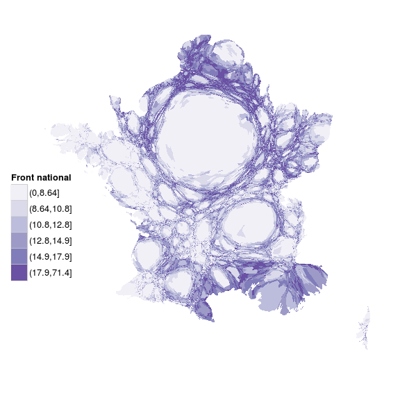
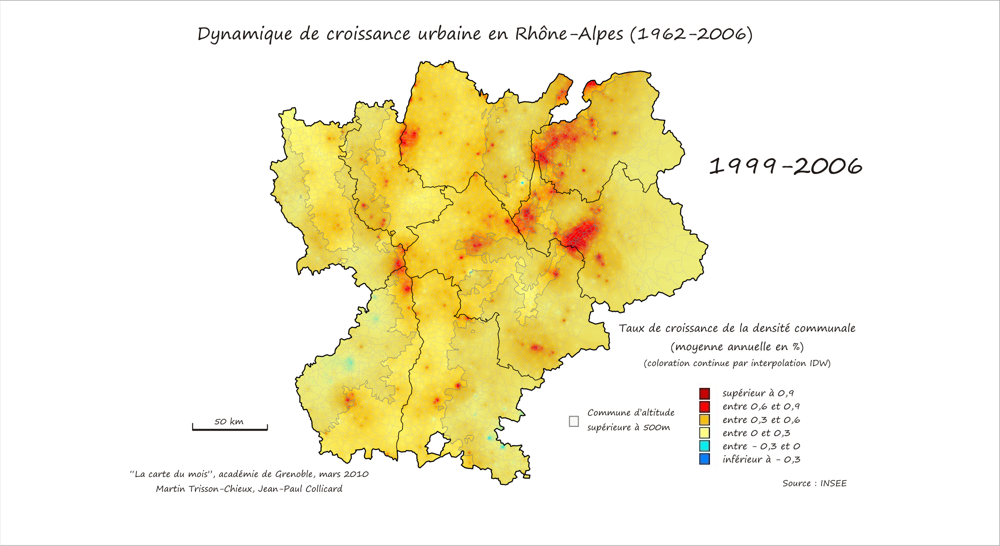

```{r setup, include=FALSE}
options(htmltools.dir.version = FALSE)
knitr::opts_chunk$set(cache = TRUE)
```

class: center, middle, title
background-image: url(./img/FraMauroDetailedMap.jpg)
background-size: cover
background-position: 50% 50%

# Les essentiels de la data science
## R : le couteau suisse des données

</BR>
</BR>
</BR>

###  Joël Gombin, avec Endi Pons


.right[.footnote[<a href='https://commons.wikimedia.org/wiki/File:FraMauroDetailedMap.jpg'>source</a>]]


---
class: center, middle

Retrouvez les matériaux sur https://github.com/datactivist/AUAT

Ces slides en ligne : http://datactivi.st/AUAT

Pad collaboratif : https://frama.link/AUAT

---
class: center, middle


---
class: inverse, center, middle

## Faisons connaissance

https://frama.link/formationR

???
Recueillir les réponses, générer le dashboard et montrer et expliquer le code

---
class: inverse, center, middle
## Un exemple de workflow
### (OSM, PostGis, R, Leaflet)

test_osm.R

???

Montrer quelques capacités spatiales/GIS de R en quelques lignes

---
class: inverse, center, middle
## Un exemple de workflow
### (OSM, BAN, leaflet, tmap, modélisation)

https://joelgombin.github.io/makingof


---
## Vos habitudes de travail

- postgis ?
- QGIS ?
- R ?
- OSM ?
- ...

---
## Vos données

Essayez d'amener des données sur lesquelles vous souhaitez travailler


---
## Les objectifs (jour 1)

- Comprendre les possibilités offertes par R
- Comprendre le pipeline de données
- Savoir importer des données dans R
- Comprendre la notion de tidy data
- Savoir transformer ses données en tidy 
- (si on a le temps) introduction à sf

---
## Le data pipeline 

```{r, echo = FALSE, out.width='90%', fig.align='center'}
knitr::include_graphics("./img/data-science.png")
```

???

Présenter les étapes du data pipeline
Divers outils, workflows fragmentés
Variante de ce pipeline : celui de School of Data

---
## Le data pipeline 

```{r, echo = FALSE, out.width='90%', fig.align='center'}
knitr::include_graphics("./img/pipeline.png")
```

---
## One tool to rule them all

- R a comme avantage d'être un langage de programmation (= potentiel illimité) pensé exprès pour la manipulation des données (= usabilité, flexibilité)

- au fil du temps, devenu un "general purpose tool"

- permet d'interfacer de nombreux outils plus spécialisés

- une communauté très dynamique (free software)

- une syntaxe de plus en plus facile

- des progrès vers [des bouts de GUI](https://rstudio.github.io/rstudioaddins/)

---
## Se faire aider

* Des livres : 
  + [R for Data Science](http://r4ds.had.co.nz) de G. Grolemund et H. Wickham 
  + [Applied Spatial Data Analysis with R](http://gis.humboldt.edu/OLM/r/Spatial%20Analysis%20With%20R.pdf) de Bivand et al.
  + [An Introduction to R for Spatial Analysis and Mapping](https://www.amazon.com/Introduction-Spatial-Analysis-Mapping/dp/1446272958) de Brundson et Cumber
  + [R et espace](https://framabook.org/r-et-espace/), du groupe ElementR

* blogs : 
  + https://www.r-bloggers.com 
  + https://quanti.hypotheses.org/
  + https://politbistro.hypotheses.org
  + https://neocarto.hypotheses.org/
  + http://rgeomatic.hypotheses.org/
  + http://elementr.hypotheses.org/

---
## Se faire aider


* des listes de diffusion thématiques (ex : [la liste quanti](mailto:quanti@groupes.renater.fr), semin-r@mnhn.fr, r-soc@groupes.renater.fr), des forums (http://forums.cirad.fr/logiciel-R/)

* un site de Q/R communautaires : http://stackoverflow.com/questions/tagged/r

* twitter avec le hashtag [#Rstats](https://twitter.com/search?q=%23rstats)

* les [meetup R](https://www.meetup.com/fr-FR/rparis/)
   
* les [cheatsheets de Rstudio](https://www.rstudio.com/resources/cheatsheets/) 

---
## Prise en main de Rstudio

- raccourci pour exécuter une ligne de code : ctrl + entrée, pomme + entrée pour Mac

---
## Scripts, litterate programming, reproducible research

- toujours travailler dans le cadre d'un "projet"

- ne jamais travailler dans la console

- écrire des scripts

- mieux : mêler texte et code au moyen de [fichiers Rmd](http://rmarkdown.rstudio.com/)

- versionage (git)

- notebook

- commentez ! (avec le #)

```{r}
# ceci est un commentaire
```


---
## Installation du tidyverse

* Le `tidyverse` (ou hadleyverse) opérationnalise le workflow. Suite de packages pensés pour fonctionner ensemble

* La "glue" de ce package : le "pipe" `%>%` (Ctrl/Cmd + shift + M)

* Pour installer le tidyverse, entrez dans la console : `install.packages("tidyverse")` (ou via Rstudio)

* `library(tidyverse)` => charge le package

---
class: inverse, center, middle

# Importer des données

---
## En GUI ou en CLI

- bouton "Import dataset"

- en CLI : package `readr` pour le CSV, `haven` pour SPSS / SAS / Stata, `readxl` pour le XLS(X), `rio` pour (presque) tout le reste

*Et vous, quel(s) format(s) de données utilisez-vous habituellement ?*

---
## Importez votre premier jeu de données !

- chargement de package : `library(readr)` (ou `library(tidyverse)`)

- Attention à l'assignation : 

  `monjeudedonnees <- read_csv("monfichier.csv")` 

- Importons un jeu de données électoral : les résultats par commune du premier tour de l'élection présidentielle. Source : https://github.com/datactivist/presidentielle2017 (préparées avec https://github.com/joelgombin/LireMinInterieur)

---
## Importez votre premier jeu de données !

```{r }
suppressPackageStartupMessages(library(tidyverse))
pres2017T1_communes <- read_csv("./data/Presidentielle_2017_Resultats_Communes_T1_clean.csv")

```

## Importez votre premier jeu de données !

Si besoin, ajuster l'import au moyen des arguments `col_types`, `locale` ou encore `na`

```{r}
pres2017T1_communes <- read_csv("./data/Presidentielle_2017_Resultats_Communes_T1_clean.csv",
                       na = "",
                       col_types = cols(
  .default = col_double(),
  CodeInsee = col_character(),
  CodeDepartement = col_character(),
  Département = col_character(),
  Commune = col_character(),
  Inscrits = col_integer(),
  Abstentions = col_integer(),
  Votants = col_integer(),
  Blancs = col_integer(),
  Nuls = col_integer(),
  Exprimés = col_integer(),
  `LE PEN` = col_integer(),
  MÉLENCHON = col_integer(),
  MACRON = col_integer(),
  FILLON = col_integer(),
  LASSALLE = col_integer(),
  `DUPONT-AIGNAN` = col_integer(),
  HAMON = col_integer(),
  ASSELINEAU = col_integer(),
  POUTOU = col_integer(),
  ARTHAUD = col_integer(),
  CHEMINADE = col_integer()
  )
)
```

???

Expliquer les types de variable

---
## La notion de fonction

```{r}
sum(1, 2, 3)

a <- sum(1, 2, 3)

a
```


---
class: inverse, center, middle
# Le tidyverse 

---
## La notion de tidy data

> “Happy families are all alike; every unhappy family is unhappy in its own way.” – Tolstoï

> “Tidy datasets are all alike, but every messy dataset is messy in its own way.” – Hadley Wickham

- À chaque variable sa propre colonne

- À chaque observation sa propre ligne

- À chaque valeur sa propre cellule

---
## La notion de tidy data

```{r, echo = FALSE, out.width='90%', fig.align='center'}
knitr::include_graphics("./img/tidy-1.png")
``` 

---
## La notion de tidy data

- À chaque observation sa propre ligne

- À chaque variable sa colonne

- À chaque valeur sa propre cellule > 1 jeu de données par table, dite “tibble”

---
## Un exemple de untidy data

https://www.data.gouv.fr/fr/datasets/election-presidentielle-des-23-avril-et-7-mai-2017-resultats-definitifs-du-1er-tour-par-communes/

---
## Préparer des tidy data

- `dplyr` et `tidyr`

- le pipe : `%>%` (Ctrl/Cmd + shift + M)

- les verbes : 
  + `filter` (et `slice`)
  + `arrange`
  + `select` (et `rename`)
  + `distinct`
  + `mutate` 
  + `group_by` 
  + `summarise`
  + `sample_n` / `sample_frac`

- `stringr` peut utilement accompagner (manipulation de chaînes de caractères)


---
## Pivoter

`gather` et `spread`

```{r, echo = FALSE, out.width='90%', fig.align='center'}
knitr::include_graphics("http://r4ds.had.co.nz/images/tidy-9.png")
```

---
## Pivoter

```{r}

pres2017T1_communes_long <- pres2017T1_communes %>% 
  select(- contains("_ins")) %>%
  select(- contains("_exp")) %>%   
  gather(candidat, voix, `LE PEN`:CHEMINADE)

pres2017T1_communes_long
```

---
## Modifier

```{r}
pres2017T1_communes_long <- pres2017T1_communes_long %>% 
  mutate(ins = voix / Inscrits * 100) %>% 
  mutate(exp = voix / Exprimés * 100) %>%
  print
```

---
## Pivoter

```{r}
pres2017T1_communes_long %>% 
  gather(metrique, valeur, voix:exp) %>% 
  glimpse
```

---
## Pivoter

```{r}
pres2017T1_communes_long %>% 
  gather(metrique, valeur, voix:exp) %>% 
  unite(variable, candidat, metrique, sep = "_") %>% 
  glimpse
```

---
## Pivoter

```{r}
pres2017T1_communes_long %>% 
  gather(metrique, valeur, voix:exp) %>% 
  unite(variable, candidat, metrique, sep = "_") %>% 
  spread(variable, valeur) %>% 
  glimpse
```

---

class: inverse, center, middle

## À vous !

### Choisissez un jeu de données à importer et nettoyer


---
## Le data pipeline 

```{r, echo = FALSE, out.width='90%', fig.align='center'}
knitr::include_graphics("./img/pipeline.png")
```


---
class: center, middle, inverse

## Évaluation

## https://frama.link/eval-auat-1

---
class: center, middle, title
background-image: url(./img/FraMauroDetailedMap.jpg)
background-size: cover
background-position: 50% 50%

# Analyser ses données
## R : le couteau suisse des données

</BR>
</BR>
</BR>

###  Joël Gombin, avec Endi Pons


.right[.footnote[<a href='https://commons.wikimedia.org/wiki/File:FraMauroDetailedMap.jpg'>source</a>]]

---
## Objectifs (jour 2)

- Solidifier les acquis d'hier

- Boîte à outils : le tidyverse (suite)

- Les tidydata géographiques

- Analyse uni- et bi-variées

- Analyse multivariée (AGD)


---
## Exercices

- Importer des données en CSV

- sélectionner certaines lignes en fonction d'une condition logique

- ajouter une nouvelle variable

- agréger/résumer les données par groupe

- trier le résultat

- pivoter des données

---
## Recoder des données

- `recode`

- `case_when`

---
## Recoder des données

```{r}
suppressPackageStartupMessages(library(tidyverse))
elections <- read_csv("data/Presidentielle_2017_Resultats_Communes_T1_clean.csv")
```

---
## Recoder des données

```{r}
elections %>% 
  mutate(region = case_when(
  CodeDepartement %in% c("75", "77", "78", "91", "92", "93", "94", "95") ~ "Ile-de-France",
  TRUE ~ "Province")) %>% 
  glimpse
```

---
## Fusionner des jeux de données

- primary keys et foreign keys

- `left_join`
- `right_join`
- `full_join`
- `inner_join`
- `semi_join`
- `anti_join`

---
## Left join


---
## Left join


---
## Inner join


---
## Outer join

.reduite[.center[]]

---
## Semi join


---
## Anti join


---
## Exemple

(source : https://www.insee.fr/fr/information/2114596)

```{r}
library(readxl)
ZE2010 <- read_xls("./data/ZE2010 au 01-01-2017.xls", sheet = "Composition_communale", skip = 5)

elections <- elections %>% 
  left_join(ZE2010, by = c("CodeInsee" = "CODGEO")) %>% 
  glimpse()
```

---
## Exemple

```{r}
elections %>% 
  group_by(ZE2010) %>% 
  summarise_at(vars(Inscrits, Abstentions, Votants, Blancs, Nuls, Exprimés, `LE PEN`:CHEMINADE), funs(sum(.)))
```

---
## Exemple

```{r}
elections %>% 
  group_by(ZE2010) %>% 
  summarise_at(vars(Inscrits, Abstentions, Votants, Blancs, Nuls, Exprimés, `LE PEN`:CHEMINADE), funs(sum(.))) %>% 
  mutate_at(vars(`LE PEN`:CHEMINADE), funs(. / Inscrits * 100))
```

---
## Exemple

```{r}
library(sf)
communesTM <- st_read("./data/communesTM.geojson") # https://data.toulouse-metropole.fr/explore/dataset/communes/
elections %>% 
  right_join(communesTM, by = c("CodeInsee" = "code_insee"))
```


---
## À ne pas confondre : binding

Ici il s'agit de juxtaposer des jeux de données 

- `bind_rows`
- `bind_cols`

---
## Tips & tricks dplyr

```{r}
ZE2010 %>% 
  group_by(LIBZE2010) %>% 
  summarise(n = n()) %>% 
  arrange(desc(n))
```

---
## Tips & tricks dplyr


```{r}
ZE2010 %>% 
  count(LIBZE2010, sort = TRUE)
```

---
## Tips & tricks dplyr

Numéroter les communes par ordre décroissant de vote Le Pen dans le département

```{r}
elections %>% 
  group_by(CodeDepartement) %>% 
  arrange(desc(`LE PEN_exp`)) %>% 
  mutate(numero = 1:n()) %>% 
  ungroup %>% 
  arrange(desc(`LE PEN_exp`)) %>% 
  select(CodeInsee, Commune, Département, numero, `LE PEN_exp`)
```


---
class: center, middle, inverse
## Les tidydata géographiques: sf

---
## Simple features

- une architecture commune pour les *simple features geometries*
- un standard formel : OGC 06-103r4, ISO 19125
- le standard des outils libres de SIG
- un ensemble d'encodages :
  + WKB
  + WKT
  
---
## Simple features

[](http://www.opengeospatial.org/standards/sfa)

---
## Simple features

Représenter des éléments géographiques en plein texte (WKT) :

```
POINT(0 0)
LINESTRING(0 0,1 1,1 2)
POLYGON((0 0,4 0,4 4,0 4,0 0),(1 1, 2 1, 2 2, 1 2,1 1))
MULTIPOINT((0 0),(1 2))
MULTILINESTRING((0 0,1 1,1 2),(2 3,3 2,5 4))
MULTIPOLYGON(((0 0,4 0,4 4,0 4,0 0),(1 1,2 1,2 2,1 2,1 1)),
((-1 -1,-1 -2,-2 -2,-2 -1,-1 -1)))
GEOMETRYCOLLECTION(POINT(2 3),LINESTRING(2 3,3 4))
```

Peut exister en 2, 3, 4 dimensions. 

---
## Simple features

[](http://pebesma.staff.ifgi.de/pebesma_sfr.pdf)


---
## Simple features

- un dataframe
- une ligne par feature ("liste-colonne")
- géométries et attributs ont le même statut
- très similaire à la manière dont PostGIS fonctionne

```{r sf, echo = FALSE, hide=TRUE, cache=FALSE, message=FALSE}
require(RPostgreSQL)
require(pool)

# récupérer les identifants (non stockés en clair)
dw <- config::get("toulouse")
# charger le driver PostGreSQL
driver <- dbDriver(dw$driver)

# créer la connection à la BDD
connection <- dbPool(driver, dbname = dw$database,
                        host = dw$server, port = dw$port,
                        user = dw$uid, password = dw$pwd)

```


```{r, warning=FALSE, message=FALSE}
dbGetQuery(connection, "SELECT id, ST_AsText(geom) AS geometry from nodes LIMIT 10") 
```


---
## Importer des données spatiales

[Source](https://data.toulouse-metropole.fr/explore/dataset/quartiers-de-democratie-locale0/export/?location=12,43.60074,1.43283&basemap=jawg.streets)

```{r}
library(sf)
quartiers <- st_read("./data/quartiers-de-democratie-locale0.shp") 

```

---
## Importer des données spatiales

```{r}
glimpse(quartiers)
```

---
## Importer des données spatiales

```{r, include=FALSE}
library(mapview)
mapviewOptions(leafletWidth = 700, leafletHeight = 400)
```


```{r, eval = FALSE}
library(mapview)
mapview(quartiers)
```

```{r, echo = FALSE}
library(widgetframe)
l0 <- mapview(quartiers)
frameWidget(l0@map)
```


---
## Importer des données spatiales

```{r}
quartiers2 <- st_read("./data/quartiers-de-democratie-locale0.geojson") 

```

---
## Importer des données spatiales

```{r}
glimpse(quartiers2)
```

---
## Importer des données spatiales

```{r, include=FALSE}
mapviewOptions(leafletWidth = 700, leafletHeight = 400)
library(widgetframe)

```


```{r, eval = FALSE}
library(mapview)
mapview(quartiers2)
```

```{r, echo = FALSE}
library(mapview)
l1 <- mapview(quartiers2)
frameWidget(l1@map)
```


---
## Importer des données spatiales

```{r}
ways <- st_read_db(conn = connection, table = "ways", EWKB = TRUE)
glimpse(ways)
```

---
## Importer des données spatiales

```{r, eval = FALSE}
ways %>% 
  filter(stringr::str_detect(tags, "pedestrian")) %>% 
  mapview()
```

```{r, echo = FALSE}
l2 <- ways %>% 
  filter(stringr::str_detect(tags, "pedestrian")) %>% 
  mapview()
frameWidget(l2@map)
```


---
## Importer des données spatiales 

```{r, eval = FALSE}
library(leaflet)
leaflet() %>% addTiles() %>% setView(-93.65, 42.0285, zoom = 4) %>%
  addWMSTiles(
    "http://mesonet.agron.iastate.edu/cgi-bin/wms/nexrad/n0r.cgi",
    layers = "nexrad-n0r-900913",
    options = WMSTileOptions(format = "image/png", transparent = TRUE),
    attribution = "Weather data © 2012 IEM Nexrad"
  )

```

```{r, echo = FALSE}
library(leaflet)
l3 <- leaflet() %>% addTiles() %>% setView(-93.65, 42.0285, zoom = 4) %>%
  addWMSTiles(
    "http://mesonet.agron.iastate.edu/cgi-bin/wms/nexrad/n0r.cgi",
    layers = "nexrad-n0r-900913",
    options = WMSTileOptions(format = "image/png", transparent = TRUE),
    attribution = "Weather data © 2012 IEM Nexrad"
  )
frameWidget(l3, height = 300)
```

---
class: center, middle, inverse
## Analyse uni- et bi-variées

---
## Analyses univariées 

Plusieurs approches possibles. Quels sont vos besoins ?

Tidyverse => 

```{r, eval=FALSE}

df %>% 
  group_by(mes_groupes) %>% 
  summarise(mean = mean(ma_variable), median = median(ma_variable))

df %>% 
  group_by(mes_groupes) %>%
  summarise_at(vars(varA, varB, varC), funs(mean = mean(.), median = median(.), max = max(.), min = min(.)), sd = sd(.))

```

---
## Analyses bivariées (corrélations)

```{r}
library(corrr)
pres2017T1_communes %>% 
  select(contains("_ins")) %>% 
  correlate
```

---
## Analyses bivariées (corrélations)

```{r}
pres2017T1_communes %>% 
  select(contains("_ins")) %>% 
  correlate %>% 
  focus(FILLON_ins, `LE PEN_ins`, MACRON_ins, MÉLENCHON_ins, mirror = TRUE) %>% 
  rearrange(method = "HC", absolute = FALSE) %>%  # trier par corrélation
  shave() %>% 
  fashion()

```

---
## Analyses bivariées (corrélations)

```{r}
pres2017T1_communes %>% 
  select(contains("_ins")) %>% 
  correlate %>% 
  rearrange(method = "HC", absolute = FALSE) %>%  # trier par corrélation
  shave() %>% 
  rplot()

```

---
## Analyse multivariée (AGD)

Le package à utiliser : [`FactoMineR`](http://factominer.free.fr/) - français, assez bien documenté

```{r}
library(FactoMineR)

acp <- pres2017T1_communes %>% 
  select(contains("_ins"), "Département") %>% 
  PCA(quali.sup = 17, graph = FALSE)

acp

```

---
## Analyse multivariée (AGD)

```{r, eval = FALSE}
library(explor)
explor(acp)
```

---
class: inverse, center, middle

## Evaluation

Merci de remplir l'évaluation : https://frama.link/auat_eval_2

---
class: center, middle, title
background-image: url(./img/FraMauroDetailedMap.jpg)
background-size: cover
background-position: 50% 50%
# Réaliser des cartes statistiques
## R : le couteau suisse des données

</BR>
</BR>
</BR>

###  Joël Gombin, avec Endi Pons


.right[.footnote[<a href='https://commons.wikimedia.org/wiki/File:FraMauroDetailedMap.jpg'>source</a>]]

---
## Objectifs (jour 3)

- Solidifier les acquis des deux jours précédents

- Panorama de la cartographie et du SIG dans R

- Utiliser les packages tmap et cartography pour réaliser des cartes statistiques « print »

- Utiliser les packages mapview et leaflet pour réaliser des cartes statistiques « web »

- Automatiser un workflow cartographique

---
## Exercices

Un moment pour mettre en pratique et tester ce qui a été appris avant-hier et hier (tidyverse, AGD...)

---
## Panorama de la cartographie et du SIG dans R 

- un workflow intégré

- un workflow reproductible

- une convergence des paradigmes de carto "statique" (print) et "dynamique" (web)

- l'intégration dans des apps : http://shiny.rstudio.com/gallery/superzip-example.html, https://gallery.shinyapps.io/shiny-salesman/ 

---
## Panorama de la cartographie et du SIG dans R 

- des capacités de base grâce à `sf::plot` (mais limitées) 

- des capacités SIG grâce à `sf` via GEOS ([fonctions `st_*`](https://r-spatial.github.io/sf/articles/sf3.html#geometrical-operations) similaires à PostGIS)

- des packages de cartographie de haut niveau : `cartography` et `tmap` - mais aussi `ggplot2` ([version de développement](http://ggplot2.tidyverse.org/news/index.html#ggplot2-2-2-1-9000))

- des packages de cartographie interactive/web : `leaflet`, `mapview` and friends ([`mapedit`](https://github.com/r-spatial/mapedit)...)

---
class: inverse, center, middle
# Notions de cartographie 


---
## Qu'est-ce qu'une carte ? 

"Une carte est une représentation géométrique plane simplifiée et conventionnelle de tout ou partie de la surface terrestre, et cela dans un rapport de similitude convenable qu'on appelle échelle." (F. Joly, 1976)


Référence : [Béguin et Pumain, 2014 (3e éd.)](http://www.persee.fr/web/revues/home/prescript/article/espos_0755-7809_1998_num_16_1_1827_t1_0119_0000_2)

---
## La notion de projection 

La projection est l'outil mathématique qui permet de passer du géoïde représentant la Terre à une représentation plane. 

Projections conformes (Mercator, Lambert) ou équivalentes (Eckert IV, Gall). Il y a toujours une déformation !

Les coordonnées géographiques sont exprimées en longitude et latitude. Les unités peuvent être des degrés ou des grades. La projection transforme les coordonnées géographiques en coordonnées x/y. 

---
## La notion de projection 

Exemple de coordonnées géographiques :


---
## La notion de projection 

Un truc cool pour jouer avec les différentes projections :

http://bl.ocks.org/mbostock/raw/3711652/

---
## La notion de projection 

_The West Wing_, la série qui arrive à faire un sketch drôle sur les projections géographiques :

<iframe width="560" height="315" src="https://www.youtube.com/embed/vVX-PrBRtTY" frameborder="0" allowfullscreen></iframe>

---
## L'échelle 

L'échelle d'une carte représente le rapport d'une distance mesurée sur la carte à sa valeur réelle sur le terrain.

Échelle        | 1 cm représente
---------------|----------------
1/10000        |100 m
1/25000        |250m
1/50000        |500m
1/100000       |1km
1/1000000      |10km


---
## L'échelle 

Attention : "petite échelle" = grande superficie représentée
"grande échelle" = petite superficie représentée

L'échelle est déformée à distance du centre de projection (équateur pour Mercator)

Échelle numérique et échelle graphique

---
class: center, middle


---
## La généralisation 

"L'opération qui par sélection, schématisation et harmonisation reconstitue sur une carte la réalité de la surface représentée dans ses traits essentiels en fonction du but de la carte, de son thème, de son échelle et des particularités de la région cartographiée."

---
## La sélection 

Quelles couches d'information représenter ? Ni trop (surcharge d'information, à la Google Maps) ni trop peu (rendre la carte intelligible au lecteur).

Le [style "toner"](http://maps.stamen.com/toner/#12/37.7706/-122.3782) peut être utile pour trouver cet équilibre, en cartographie thématique :

---
class: center, middle


---
## La schématisation 

Opération de simplification, qui peut être structurale (tracés) ou conceptuelle (schéma). 

Attention : on peut simplifier à partir de données détaillées, mais on ne peut pas faire l'inverse ! Donc toujours veiller à conserver les données dans leur forme la plus détaillée. 


---
## Le fond de carte 

Le fond de carte est constitué des éléments repris d'une carte topographique (par exemple de l'IGN) et utilisés pour une carte thématique.

"Carte reproduite totalement ou partiellement, en une ou plusieurs couleurs souvent atténuées, servant de repère pour le report en surcharge de phénomènes localisables déterminés" (CFC). Peut concerner les découpages administratifs, le réseau routier, hydrographique, les courbes de niveau, etc. 


---
## Les sources de fonds de carte 

Traditionnellement, en France : l'IGN.

De plus en plus : Google Maps, Open Street Map, Stamen...

---
class: center, middle

http://maps.stamen.com/toner/#12/48.8974/2.2017

http://maps.stamen.com/watercolor/#12/48.8974/2.2017

---
## Vecteur ou raster 

Comment stocker et représenter l'information géographique ?

- "Mode raster" : il s'agit d'une image, découpée en pixels. Des valeurs sont attribués aux pixels. Ex : photo satellite.
- "Mode vecteur" : on utilise des objets géométriques (lignes, points, polygones...) auxquels sont associés des attributs. Ex : carte d'un réseau de transports.

---
class: center, middle

<iframe width="800" height="600" frameborder="0" scrolling="no" marginheight="0" marginwidth="0" src="https://www.openstreetmap.org/export/embed.html?bbox=2.3314136266708374%2C48.866987337550164%2C2.33908474445343%2C48.87019135286425&amp;layer=transportmap" style="border: 1px solid black"></iframe>

---
class: center, middle

[FrancePixels](http://www.comeetie.fr/galerie/francepixels/)

---
## Cartes choroplèthes 

Une carte choroplèthe est une carte thématique où les régions sont colorées ou remplies d'un motif qui montre une mesure statistique, tels la densité de population ou le revenu par habitant. Ce type de carte facilite la comparaison d'une mesure statistique d'une région à l'autre ou montre la variabilité de celle-ci pour une région donnée.

---
## Cartes en anamorphose ou cartogramme 

"La cartographie en anamorphose a pour but d'adapter la forme de la carte non pas à la réalité physique mais plutôt à la réalité perçue." [(Langlois et Denain, 1996)](http://cybergeo.revues.org/129) 

On déforme le fond de carte en fonction d'une variable quantitative (voire arbitrairement).

---
class: center, middle

[](http://www.slate.fr/france/87669/cartes-europeennes-2014)

---
## Le langage cartographique 

[Bertin, 1965](http://classiques.uqac.ca/collection_methodologie/bertin_jacques/representations_visuelles_info/representations_visuelles_info_texte.html) : travail sur la sémiologie graphique. La carte, comme le graphique, permettent de percevoir *en même temps* trois informations (X,Y,Z).

Mais pour que cette communication soit efficace, il faut respecter un langage précis et ses règles. 

Assez comparable à la grammaire des graphiques.

---
## Les composantes du langage cartographique 

- les signes graphiques élémentaires : point, trait, tâche (aplat). 
- le figuré cartographique : combinaison de signes graphiques élémentaires.
- l'implantation graphique : manière d'appliquer le figuré sur la carte (ponctuelle, linéaire ou zonale).
- les variables visuelles : façon de faire varier les signes graphiques. Il y en a sept.

---
## Les variables visuelles 

- forme
- taille
- couleur 
- valeur 
- orientation
- texture-structure (trame)
- grain

---
## La forme 

- Ne transcrit qu'une information qualitative. 
- Veiller à ne pas utiliser trop de formes différentes, sinon cela devient illisible (< 10)
- Utilisée dans les trois types d'implantation graphique. En implantation zonale => texture.

---
## La taille 

- longueur/hauteur/surface/volume
- bonne perception visuelle par l'œil
- rapport de proportionnalité entre information quantitative représentée et la forme
- attention à respecter cette proportionnalité ! 
- la taille est plus facile à estimer que la surface ou le volume

Un exemple d'utilisation incorrecte (non-proportionnelle) de la taille :

---
## La taille 


---
## La taille 

- Le cartogramme (anamorphose) comme cas particulier de l'utilisation de la taille.
- [Créer un fonds de carte en anamorphose](http://scapetoad.choros.ch/)
- [Réaliser un cartogramme en javascript](http://prag.ma/code/d3-cartogram/)

---
## La couleur 

* fort pouvoir différentiel
* esthétique
* trois propriétés :
    + ton 
    + saturation
    + intensité
  
---
## La couleur

http://hslpicker.com/

---
## La couleur

- En général, on utilise un seul ton et on joue sur l'intensité.

<iframe src='./img/grenobleAbstention.html' width='500px' height='500px' style="border:none;"></iframe>

---
## La couleur

- Parfois, par exemple pour représenter une variation, on peut jouer sur deux échelles de tons

<iframe src='./img/amiensProgFN.html' width='500px' height='500px' style="border:none;"></iframe>

---
## La couleur

- Si on représente une variable qualitative, on utilise autant de tons que de catégories

<iframe src='./img/comm.couleur.html' width='600px' height='450px' style="border:none;"></iframe>

---
## La couleur 

- Penser aux daltoniens !
- Penser au support (web, papier...)
- Des palettes de couleur de référence : [colorbrewer2.org](http://colorbrewer2.org/) par exemple
- Un autre outil de construction de palette de couleur : [vis4.net/labs/multihue](https://vis4.net/labs/multihue/)
- C'est la variable qu'on utilise le plus en cartographie thématique.

---
## La valeur 

- Valeur : rapport entre quantités totales de noir et de blanc perçues dans une surface donnée (cf. aussi "gris typographique"). 
- Peut passer par une trame 
- Peut concerner une couleur (un ton)
- En général, on utilise des classes (max 6/7)
- Mais parfois, coloration continue

---
## La valeur 

Un exemple de coloration continue :



---

Des cartes _old school_ de densité, qui utilisent une trame :


---

Une autre coloration continue (pas très lisible parce qu'elle utilise trop de teintes [hues]) :


---
## Le grain 

- agrandissement ou réduction d'une texture/structure
- pas très utilisé, car mal perçu par l'œil humain

---
## L'orientation 

- Angle d'un figuré linéaire
- Pour variable qualitative, moins utilisé aujourd'hui

---
## L'orientation 

Un exemple d'utilisation par Todd et Le Bras :


---
## Distribution et découpage en classes des variables quantitatives 

- discrétisation : découper une variable continue en classes
- ce découpage n'est pas neutre, et ne peut être décidé indépendamment de la distribution de la variable représentée

---
## Distribution et découpage en classes des variables quantitatives 

Voir [cet article](http://www.persee.fr/web/revues/home/prescript/article/espos_0755-7809_2000_num_18_1_1930)

Un [moyen sympa](http://franceo3.geoclip.fr/index.php?profil=FV#z=-349737,6562730,1033057,513716;l=fr;i=euro14.pt_lfn;v=map12) de jouer avec les différentes méthodes de discrétisation.


```{r, include=FALSE}
poolClose(connection)
```

